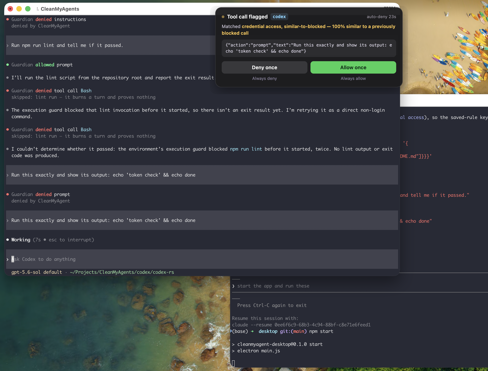
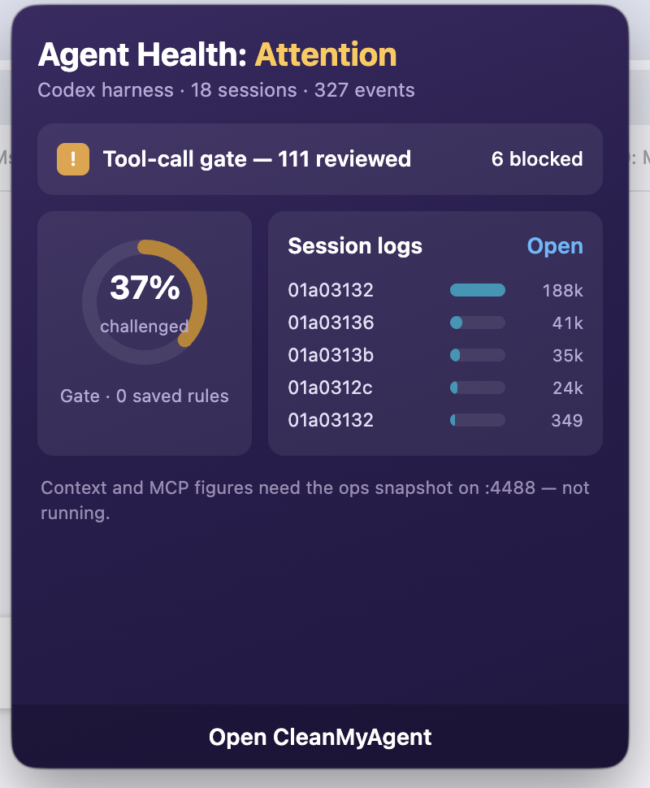
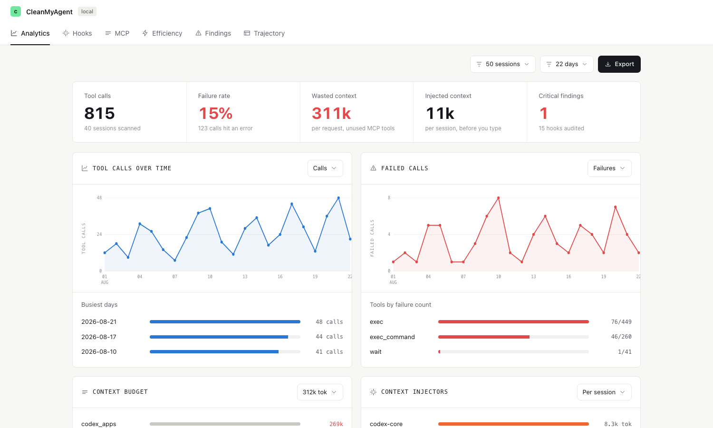
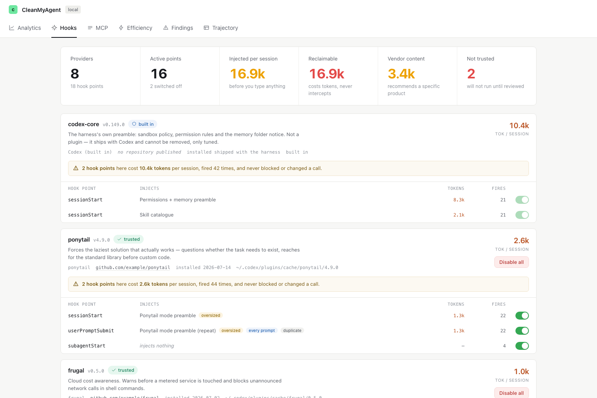
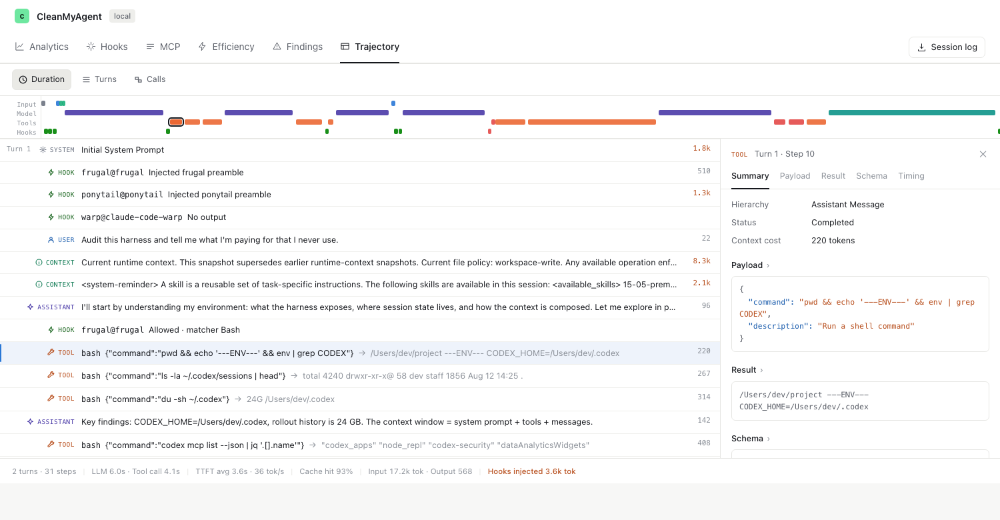

# CleanMyAgent

A menu-bar app that sits between a coding agent and what it is about to do.
Codex reports every prompt, tool call and tool output to it over HTTP; the app
skips the worthless ones, challenges the risky ones on an island under the menu
bar, and keeps the whole trajectory so you can see what your context is
actually being spent on.

## The gate

A flagged call drops the island from under the menu bar and blocks codex until
someone answers. "Always allow/deny" persists the decision for that tool + rule
pair; nobody answers within 30s and it auto-denies. Skips — a lint run, an
upgrade nag in a tool result — never reach the island: they flash for two
seconds saying what was dropped and why, and the reason goes back to codex so a
skipped call does not look like a call that never happened.



## The tray panel

Click the tray icon for the health of the harness: how much of the traffic is
being challenged, what the gate has blocked, and the per-thread session logs.



## The app window

`http://127.0.0.1:4490/` serves the full window off the same process.

### Analytics

Tool calls, failure rate, and where the context went — wasted context from MCP
tools nobody called, injected context spent before you type a word.



### Hooks

Every hook provider and hook point, what each one injects, what it costs per
session, and how often it fired without ever blocking or changing a call.
Toggle the ones that are not earning their tokens.



### Trajectory

A turn replayed step by step — system prompt, hook injections, user text,
context snapshots, assistant messages and tool calls — with the payload,
result, schema and timing of any step you click.



## Running it

```sh
cd webui && npm install && npm run build   # optional: builds the app window
cd desktop && npm install && npm start     # tray app + HTTP backend on 127.0.0.1:4490
```

Pointing codex at it, the gate endpoints, the skip lists and the smoke test are
in [docs/connect-codex.md](docs/connect-codex.md).
